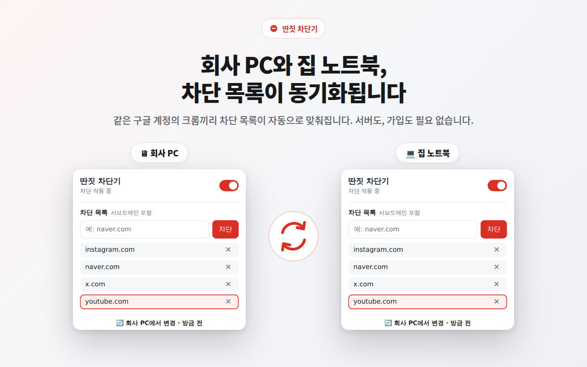

# 딴짓 차단기

> 차단할 사이트를 적기만 하면 됩니다. 서브도메인까지 한 번에 차단하고, 필요한 곳만 예외로 열어두세요.

유튜브와 커뮤니티 사이트를 나도 모르게 들어가고 있었습니다.
더 나은 나를 만들기 위한 첫걸음으로 이 확장 프로그램을 만들었습니다.



## 주요 기능

- **도메인 하나만 입력** — `naver.com` 을 넣으면 `m.naver.com`, `blog.naver.com` 까지 함께 차단됩니다
- **예외 목록** — 네이버는 막고 지도(`map.naver.com`)만 열어두는 식으로 세밀하게 조정할 수 있습니다
- **단어 문제 잠금** — 비밀번호가 없습니다. 팝업을 열 때 단어 한 문제를 맞히면 5분 동안 열립니다. 잊어버릴 것도 없습니다
- **문제는 내가 정합니다** — 단어 · 발음기호 · 뜻을 엑셀에서 직접 고쳐 넣을 수 있습니다
- **기기 간 동기화** — 같은 구글 계정의 크롬끼리 차단 목록이 자동으로 맞춰집니다 (서버 없음, 크롬 동기화 사용)
- **동기화 기록 · 되돌리기** — 어느 기기가 언제 목록을 바꿨는지 최근 10개를 남기고, 그때 상태로 되돌릴 수 있습니다
- **백업 · 불러오기** — 설정을 엑셀 파일로 내보내고 불러옵니다
- **차단된 주소 확인** — 차단 화면에 어떤 주소가 막혔는지 전체 주소를 보여줍니다. 요란한 경고 없이 조용히 멈춰 세웁니다

## 설치

### 크롬 웹스토어

_(심사 통과 후 링크가 추가됩니다)_

### 개발자 모드로 직접 설치

1. 이 저장소를 내려받습니다 (`Code` → `Download ZIP` 또는 `git clone`)
2. 크롬 주소창에 `chrome://extensions` 입력
3. 오른쪽 위 **개발자 모드** 켜기
4. **압축해제된 확장 프로그램을 로드합니다** 클릭
5. 이 저장소의 **`extension`** 폴더를 선택

## 동작 방식

크롬의 [`declarativeNetRequest`](https://developer.chrome.com/docs/extensions/reference/api/declarativeNetRequest) API 로
**페이지 요청 단계에서** 차단합니다. 사이트가 열리기 시작하기 전에 끊어내므로 화면에 잠깐 스치는 일도 없습니다.

예외는 두 겹으로 걸려 있습니다.

1. 차단 규칙(`redirect`, priority 1)의 조건에 `excludedRequestDomains` 로 예외 도메인을 넣어 매칭 자체를 막고
2. 예외 규칙(`allow`, priority 2)을 따로 추가해 우선순위로 다시 한 번 이깁니다

둘 중 하나만 동작해도 예외가 유지됩니다.

## 권한

설치할 때 **모든 사이트에 대한 권한을 요구하지 않습니다.**

`declarativeNetRequestWithHostAccess` 와 `optional_host_permissions` 를 사용해,
사용자가 차단 목록에 직접 추가한 사이트에 대해서만 그때그때 권한을 요청합니다.

## 개인정보

**개발자가 운영하는 서버로는 어떤 데이터도 보내지 않습니다.** 외부 서버와 통신하는 코드가 존재하지 않습니다.
차단 목록과 설정은 사용자의 브라우저 안에 저장되고, 크롬 동기화를 켜 두었다면
**사용자 본인의 구글 계정을 통해** 본인의 다른 크롬으로만 전달됩니다.

자세한 내용은 [개인정보처리방침](https://wook8888.github.io/ddanjit-blocker/)을 참고하세요.

## 알아두실 점

`chrome://extensions` 에서 이 확장을 끄거나 삭제하면 차단도 해제됩니다.
잠금 문제의 정답도 확장 프로그램 파일 안에 들어 있습니다.
무심코 하는 딴짓을 한 박자 늦추는 용도이지, 작정하고 뚫으려는 시도까지 막아주지는 못합니다.

## 저장소 구성

```
extension/      확장 프로그램 소스 (이 폴더를 크롬에 로드)
  words.js        잠금 문제에 쓰이는 단어 (엑셀에서 교체 가능)
docs/           개인정보처리방침 페이지 (GitHub Pages)
store-assets/   웹스토어 스크린샷·프로모 타일·리스팅 문구
SYNC-SETUP.md   PC · 맥북 동기화 설정 방법
```

## 라이선스

[MIT](LICENSE)
